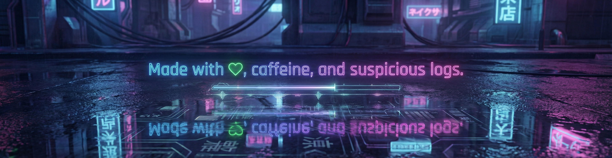

<!-- ═══════════════════════ HEADER ═══════════════════════ -->
<div align="center">
  
</div>

<!-- Capsule render wave separator -->
<div align="center">
  
</div>

<!-- Typing animation -->
<div align="center">

[](https://git.io/typing-svg)

</div>

<!-- Social badges -->
<div align="center">

[](https://www.linkedin.com/in/mohammad-raouf-abedini-885a9226a/)
[](https://raoof128.github.io/Portfolio/)
[](https://github.com/Raoof128)
[](mailto:raoof.r12@gmail.com)
[](https://github.com/Raoof128)

</div>

<br/>

<!-- ═══════════════════════ TERMINAL SVG ═══════════════════════ -->
<div align="center">
  
</div>

<br/>

<!-- ═══════════════════════ ABOUT ═══════════════════════ -->


<table>
<tr>
<td valign="top" width="55%">

### `> ./about_me --verbose`

```
╔════════════════════════════════════════╗
║  🔐  SOC Pipelines & Detection Engines ║
║  🎯  Full Attack–Defence Simulations   ║
║  🤖  AI + Cybersecurity Convergence    ║
║  🛰  LEO Satellite Security Research   ║
║  🧬  LLM Red Teaming & Adversarial ML  ║
║  🏛  AU Compliance: SOCI·E8·CDR·PrivAct║
║  🚀  Security Tools that Look Futuristic║
╚════════════════════════════════════════╝
```

</td>
<td valign="top" width="45%">

<br/>


</td>
</tr>
</table>

<br/>

<!-- ═══════════════════════ SKILLS ═══════════════════════ -->
<div align="center">


### `> skills --list-all`

<br/>

**[ LANGUAGES ]**

[](https://skillicons.dev)
[](https://skillicons.dev)
[](https://skillicons.dev)
[](https://skillicons.dev)
[](https://skillicons.dev)
[](https://skillicons.dev)
[](https://skillicons.dev)
[](https://skillicons.dev)
[](https://skillicons.dev)

**[ AI / ML ]**

[](https://skillicons.dev)
[](https://skillicons.dev)
[](https://skillicons.dev)
[](#)
[](#)
[](#)

**[ CLOUD & DEVOPS ]**

[](https://skillicons.dev)
[](https://skillicons.dev)
[](https://skillicons.dev)
[](https://skillicons.dev)
[](https://skillicons.dev)
[](https://skillicons.dev)
[](https://skillicons.dev)
[](https://skillicons.dev)

**[ SECURITY TOOLING ]**

[](#)
[](#)
[](#)
[](#)
[](#)
[](#)
[](#)
[](#)
[](#)
[](#)
[](#)

</div>

<br/>

<!-- ═══════════════════════ STATS ═══════════════════════ -->
<div align="center">

### `> cat stats.json`

<br/>


<br/>

[](https://git.io/streak-stats)

<br/>

[](https://github.com/ryo-ma/github-profile-trophy)

</div>

<br/>

<!-- ═══════════════════════ CONTRIBUTION SNAKE ═══════════════════════ -->
<div align="center">

### `> ./contributions --animate`

<picture>
  <source media="(prefers-color-scheme: dark)"  srcset="https://raw.githubusercontent.com/Raoof128/Raoof128/output/github-contribution-grid-snake-dark.svg"/>
  <source media="(prefers-color-scheme: light)" srcset="https://raw.githubusercontent.com/Raoof128/Raoof128/output/github-contribution-grid-snake.svg"/>
  
</picture>

</div>

<br/>

<!-- ═══════════════════════ 3D CONTRIBUTION ═══════════════════════ -->
<div align="center">

### `> contrib3d --render`


</div>

<br/>

<!-- ═══════════════════════ ACTIVITY GRAPH ═══════════════════════ -->
<div align="center">

### `> htop --graph`

[](https://github.com/ashutosh00710/github-readme-activity-graph)

</div>

<br/>

<!-- ═══════════════════════ PROJECTS ═══════════════════════ -->
<div align="center">

### `> ls -la /projects/`

</div>

<table>
<tr>
<td valign="top" width="50%">

#### 🔥 Core Security Labs

> **🧩 Active Directory Attack & Defence Lab**
> Purple-team: AS-REP roasting, kerberoasting, DC-sync, Pass-the-Hash — correlated through Sysmon + Wazuh

> **🪲 Malware Analysis Sandbox**
> Automated RE + behavioural analysis — YARA rules, API hooking, Cuckoo-style dynamic execution pipeline

> **🛰 LEO Satellite Cyber Lab**
> Uplink jamming, command spoofing, ground-station intrusion + full defence telemetry pipeline

> **🕸 T-Pot Honeypot + Threat Intel**
> Cluster honeypot deployment with ML classification of live attacker TTPs and attribution scoring

> **🛡 SOC Automation Engine**
> Python-driven SOAR playbooks, auto-correlation, KQL/SPL detectors, E8 maturity dashboard

</td>
<td valign="top" width="50%">

#### 🤖 AI Security & Detection

> **🧬 AI Red Team / LLM Security Framework**
> Injection testing, jailbreak detection, hallucination scoring, adversarial prompt generation at scale

> **👁 AI-Powered Scam Detection Platform**
> Transformer-based fraud engine + automated reporting dashboard tailored for AU authorities

> **🔍 ML Network Anomaly Detection**
> Zeek/Suricata → feature pipelines → Isolation Forest, Autoencoders, LSTM anomaly models

> **🔐 Real-Time Phishing Browser Extension**
> URL scoring engine, DOM structure fingerprinting, live content ML classification

</td>
</tr>
</table>

<br/>

<!-- ═══════════════════════ COMPLIANCE SUITE ═══════════════════════ -->
<div align="center">

#### 🇦🇺 Australian Compliance Suite

| 🏛 SOCI Act | 🧱 Essential Eight | 🔑 CDR Validator | 🧪 PQC Auditor |
|:---:|:---:|:---:|:---:|
| Asset classification + rule mapping → continuous compliance engine | MITRE ATT&CK detections, maturity scoring, GPO drift tracking | AU open banking (FAPI 2.0), TLS, OAuth 2.0 testing suite | Quantum-risk scanner for AU org crypto inventories |

</div>

<br/>

<!-- ═══════════════════════ CONNECT ═══════════════════════ -->
<div align="center">

### `> ping --connect`

```
> Establishing secure channel...
> Protocol  : TLS 1.3 | Auth: Mutual
> Encryption : AES-256-GCM
> Target     : Mohammad Raouf Abedini
> Status     : [●] ONLINE — ready to collaborate
```

[](https://www.linkedin.com/in/mohammad-raouf-abedini-885a9226a/)
[](https://raoof128.github.io/Portfolio/)
[](mailto:raoof.r12@gmail.com)

<br/>




</div>
