<!-- ══════════════════════════════ HEADER ══════════════════════════════ -->
<div align="center">
  
</div>

<!-- Typing animation — JetBrains Mono, cyan -->
<div align="center">

[](https://readme-typing-svg.demolab.com)

</div>

<!-- Social badges — cyan/amber/purple palette from portfolio -->
<div align="center">

[](https://www.linkedin.com/in/mohammad-raouf-abedini-885a9226a/)
[](https://raoufabedini.dev)
[](https://orcid.org/0009-0000-6214-258X)
[](mailto:raoof.r12@gmail.com)
[](https://github.com/Raoof128)

</div>

<br/>

<!-- ══════════════════════════════ TERMINAL SVG ══════════════════════════════ -->
<div align="center">
  
</div>

<br/>

<!-- Portfolio section divider: cyan → purple → amber -->


<br/>

<!-- ══════════════════════════════ ABOUT ══════════════════════════════ -->
<div align="center">

### `> ./about_me --verbose`

</div>

```
╔══════════════════════════════════════════════════════════════════════════╗
║  🔬  AI Security Researcher — Vulnerability Discovery & Disclosure      ║
║  📄  Authored "The Invisible Window" — 100% Screen Capture Evasion      ║
║  🤖  AI Model Evaluation for Anthropic (Claude Code Human Preference)   ║
║  🧬  LLM Safety · Capability Uplift Measurement · Dual-Use Risk        ║
║  💻  Systems Programming — C/C++ Engines · Python Tooling · Swift       ║
║  🎓  B.Cyber Security — Macquarie University (Graduating Nov 2026)      ║
╚══════════════════════════════════════════════════════════════════════════╝
```

<br/>

<!-- Portfolio section divider -->


<br/>

<!-- ══════════════════════════════ RESEARCH ══════════════════════════════ -->
<div align="center">

### `> cat /research/*.md`

</div>

<table>
<tr>
<td>

**📄 The Invisible Window** &nbsp; 

*Exploiting OS-Level Display Affinity to Bypass WebRTC Proctoring Systems*

     

- **100% screen capture evasion** across Windows 10/11 and macOS 14–26 via W3C Screen Capture / OS compositing trust boundary violation — zero artefacts over 10,000+ frames
- **Novel finding:** Apple's macOS 15 ScreenCaptureKit mitigation remains ineffective on macOS 26 — contradicting vendor assumptions through pixel-level forensic verification
- **Coordinated disclosure** to 3 proctoring vendors (ProctorU, Proctorio, Respondus) + 2 OS vendors (Microsoft, Apple) following OWASP/FIRST/CISA frameworks
- Documented measurable **AI capability uplift** and characterised **intent-vs-artefact safety boundaries** — directly relevant to ASL threshold calibration

<div align="center">

[](https://raoufabedini.dev/projects/invisible-window-research)

</div>

</td>
</tr>
<tr>
<td>

**📄 Project Simurgh** &nbsp; 

*Privacy-Preserving Device Integrity Proofs for Capture-Resistant High-Stakes Sessions*

    

- Replaces surveillance-first visual monitoring with **signed, metadata-only integrity proofs** — no screen-capture data collected at any point
- Combines browser behavioural telemetry, local device integrity daemons, and **Ed25519 cryptographic challenge-response proofs** to verify session authenticity
- Addresses documented OS display-affinity behaviours on Windows and macOS where visible windows are omitted from capture surfaces, invalidating capture-based trust models
- Architecture designed for AI-mediated and remote assessment sessions with **zero PII exposure** to proctoring infrastructure

<div align="center">

[](https://raoufabedini.dev)

</div>

</td>
</tr>
</table>

<br/>

<!-- Portfolio section divider -->


<br/>

<!-- ══════════════════════════════ SKILLS ══════════════════════════════ -->
<div align="center">

### `> skills --list-all`

<br/>

**[ LANGUAGES ]**

[](https://www.python.org)
[](https://en.cppreference.com/w/c)
[](https://isocpp.org)
[](https://www.typescriptlang.org)
[](https://developer.mozilla.org/en-US/docs/Web/JavaScript)
[](https://swift.org)
[](https://kotlinlang.org)
[](https://www.gnu.org/software/bash/)
[](https://go.dev)
&nbsp;
[](https://www.postgresql.org)

**[ AI / ML ]**

[](https://www.anthropic.com)
[](https://en.wikipedia.org/wiki/Natural_language_processing)
[](https://www.anthropic.com/research)
[](https://docs.anthropic.com)

**[ SYSTEMS & TOOLS ]**

[](https://www.linux.org)
[](https://www.docker.com)
[](https://cmake.org)
[](https://github.com/features/actions)
[](https://www.cloudflare.com)
[](https://fastapi.tiangolo.com)
&nbsp;
[](https://google.github.io/googletest/)
[](https://www.tcpdump.org)

**[ SECURITY TOOLING ]**

[](https://www.kali.org)
&nbsp;
[](https://portswigger.net/burp)
[](https://www.wireshark.org)
[](https://nmap.org)

**[ FRAMEWORKS ]**

[](https://owasp.org)
[](https://attack.mitre.org)
[](https://www.nist.gov/cyberframework)
[](https://www.w3.org/TR/screen-capture/)

</div>

<br/>

<!-- Portfolio section divider -->


<br/>

<!-- ══════════════════════════════ PROJECTS ══════════════════════════════ -->
<div align="center">

### `> ls -la /projects/`

</div>

<table>
<tr>
<td valign="top" width="50%">

#### ⚙️ Systems & Security

> **NanoMatch** &nbsp; 
>
>   
>
> High-performance matching engine processing **1M+ orders/sec** with sub-microsecond latency — red-black tree price levels, custom memory pool allocator, p50/p99 benchmarks

> **SentinelFlow** &nbsp; 
>
>   
>
> Real-time packet processing engine parsing **500K+ packets/sec** — protocol dissection (Ethernet/IPv4/TCP/UDP/ICMP/DNS), signature-based detection, stateful analysis

> **SimurghForge** &nbsp; 
>
> 
>
> Universal file converter — batch conversion pipeline supporting multiple formats, local-first privacy-preserving document processing

</td>
<td valign="top" width="50%">

#### 🤖 Full-Stack & AI

> **[Nexus Archive](https://github.com/Raoof128/Nexus_Archive)** &nbsp; 
>
>    
>
> Full-stack data platform with AI recommendation engine, event-driven API, rate limiting, and automated security scanning — end-to-end ownership from schema to deployment

> **Aion** &nbsp; 
>
>    
>
> AI-powered Bible companion with **Agentic Hybrid RAG** chat — keyword + semantic search over pgvector, dynamic verse cards, Perplexity-style interface grounded via Gemini 3 Flash

> **Mehr Guard** &nbsp; 
>
>   
>
> Cross-platform offline threat detection with local ML classification — submitted to KotlinConf global developer conference

</td>
</tr>
</table>

<div align="center">

*70+ additional public projects covering vulnerability research, systems programming, AI/ML tooling, and cloud infrastructure*

</div>

<br/>

<!-- Portfolio section divider -->


<br/>

<!-- ══════════════════════════════ CURRENTLY BUILDING ══════════════════════════════ -->
<div align="center">

### `> ps aux | grep active_builds`

| 🛠 Project | Description | Stack | Status |
|:---|:---|:---|:---:|
| **Aion** | AI Bible companion · Agentic Hybrid RAG |    |  |
| **SimurghForge** | Universal file converter · local-first |  |  |
| **Nexus OS** | Cyberpunk desktop environment |   |  |

</div>

<br/>

<!-- Portfolio section divider -->


<br/>

<!-- ══════════════════════════════ EDUCATION ══════════════════════════════ -->
<div align="center">

### `> cat /etc/education`

| 🎓 Degree | 🏛 Institution | 📅 Period |
|:---|:---|:---|
| **Bachelor of Cyber Security** | Macquarie University | May 2024 – Nov 2026 |
| **Diploma of Information Technology** | Macquarie University | Jul 2023 – May 2024 |

*Coursework: Digital Forensics · Network Security · Systems Security · Cloud Computing · NLP & Machine Learning · Privacy-Preserving Data Analysis*

</div>

<br/>

<!-- Portfolio section divider -->


<br/>

<!-- ══════════════════════════════ AI SAFETY & COMMUNITY ══════════════════════════════ -->
<div align="center">

### `> cat /community/ai-safety.md`

</div>

> 🤖 **Anthropic** — Completed AI model evaluation (Claude Code Human Preference) — benchmarked LLM code outputs for quality, security, correctness, and reliability

> 🔬 **Research Directions** — Proposed systematic uplift measurement across vulnerability classes, intent-vs-artefact safety boundary generalisation, and defensive application development to Anthropic's Fellows team

> 🎓 **Mentoring** — Mentored peers in cybersecurity, C/C++ programming, and systems-level problem-solving at Macquarie University

<br/>

<!-- Portfolio section divider -->


<br/>

<!-- ══════════════════════════════ STATS ══════════════════════════════ -->
<div align="center">

### `> cat stats.json`

<br/>


<br/>


&nbsp;

&nbsp;


<br/>

[](https://git.io/streak-stats)

<br/>


</div>

<br/>

<!-- Portfolio section divider -->


<br/>

<!-- ══ ALIEN ══ -->
<div align="center">

### `> ./entity --walk`



</div>

<br/>

<!-- ══════════════════════════════ ACTIVITY GRAPH ══════════════════════════════ -->
<div align="center">

### `> htop --graph`

[](https://github.com/ashutosh00710/github-readme-activity-graph)

</div>

<br/>

<!-- Portfolio section divider -->


<br/>

<!-- ══════════════════════════════ CONNECT ══════════════════════════════ -->
<div align="center">

### `> ping --connect`

```
> Establishing secure channel...
> Protocol   : TLS 1.3  |  Auth: Mutual
> Encryption : AES-256-GCM
> Target     : Mohammad Raouf Abedini
> Status     : [●] ONLINE — ready to collaborate
```

[](https://www.linkedin.com/in/mohammad-raouf-abedini-885a9226a/)
[](https://raoufabedini.dev)
[](mailto:raoof.r12@gmail.com)
[](https://orcid.org/0009-0000-6214-258X)

<br/>



</div>
